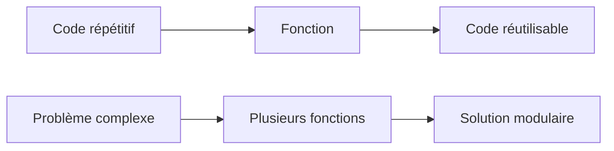
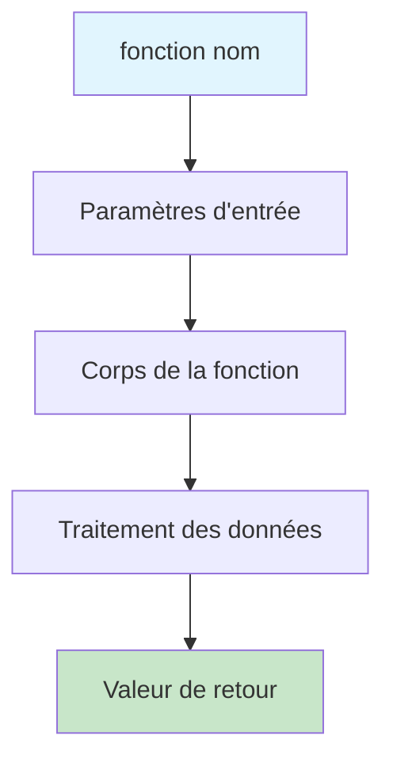
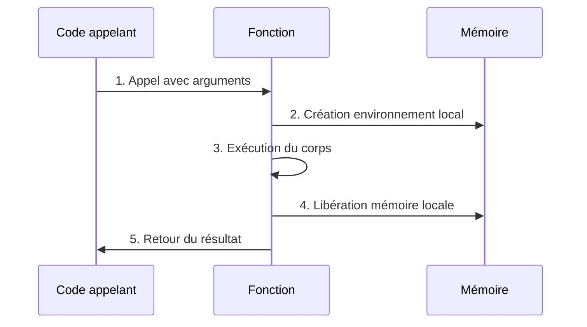
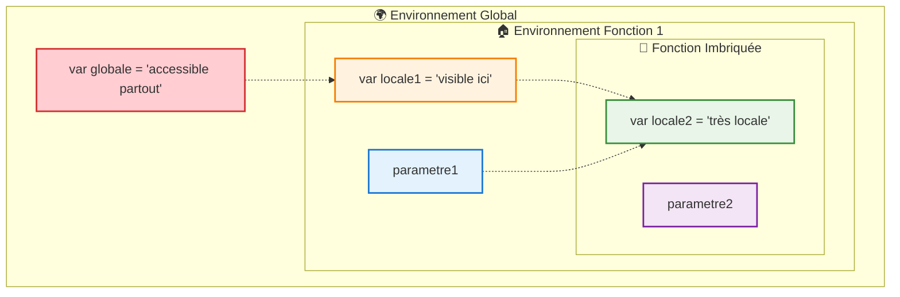
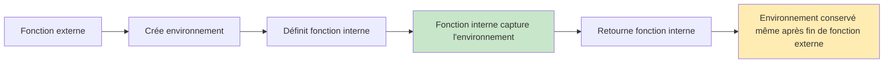
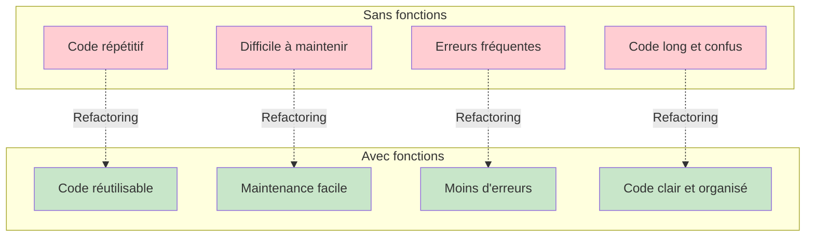
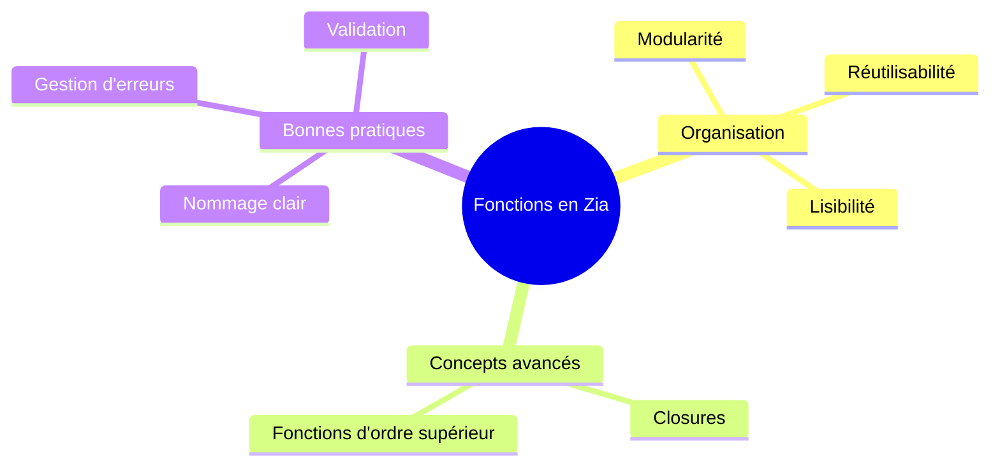

# Les Fonctions en Zia

## Structurer et réutiliser votre code avec élégance

> *"Une fonction bien conçue est comme un artisan : elle transforme des matières premières (paramètres) en une pièce d'orfèvrerie (résultat), sans gaspillage."*

---

## 🎯 Qu'est-ce qu'une fonction ?

Les fonctions sont le cœur de la programmation en Zia. Elles permettent de créer des programmes modulaires, réutilisables et expressifs, en suivant la logique naturelle de la langue française.

**Pourquoi utiliser des fonctions ?**

- **Réutilisabilité** : Écrivez une fois, utilisez partout
- **Organisation** : Structurez votre code en blocs logiques
- **Maintenance** : Modifiez facilement votre code
- **Lisibilité** : Rendez votre code plus compréhensible



---

## 🏗️ Anatomie d'une fonction



**Structure complète d'une fonction :**

```zia
fonction nomDeLaFonction(parametre1, parametre2) {
    // Variables locales
    var resultat = parametre1 + parametre2;
    
    // Traitement
    si (resultat > 0) {
        afficher "Résultat positif !";
    }
    
    // Retour
    retourner resultat;
}
```

### Fonction la plus simple

```zia
fonction saluer() {
    afficher "Bienvenue dans Zia !";
}

// Appel de la fonction
saluer(); // Sortie: Bienvenue dans Zia !
```

---

## 🔄 Cycle de vie d'une fonction



**Exemple pratique :**

```zia
fonction multiplier(a, b) {
    var resultat = a * b;      // 2. Variables locales créées
    afficher "Calcul en cours..."; // 3. Exécution
    retourner resultat;        // 4. Retour du résultat
}                              // 5. Nettoyage automatique

var produit = multiplier(5, 3); // 1. Appel
afficher produit; // 15
```

---

## 🔐 Portée des variables et environnements



**Exemple concret :**

```zia
var messageBienvenue = "Bonjour"; // Variable globale

fonction creerGreeter(nom) {
    var prefixe = "M./Mme "; // Variable de la fonction externe

    fonction saluerFormellement() {
        var ponctuation = " !"; // Variable de la fonction interne
        // Accès à toutes les variables des niveaux supérieurs
        afficher messageBienvenue + " " + prefixe + nom + ponctuation;
    }

    retourner saluerFormellement;
}

var greeter = creerGreeter("Alice");
greeter(); // "Bonjour M./Mme Alice !"
```

---

## 🧩 Closures : La puissance des fonctions

Les closures permettent aux fonctions de "capturer" et de conserver l'accès aux variables de leur environnement de création.



### Exemple : Générateur de fonctions personnalisées

```zia
fonction creerCompteur(valeurInitiale) {
    // Cette variable est "capturée" par la closure
    var compteur = valeurInitiale;

    fonction incrementer() {
        // La fonction interne modifie la variable de la fonction externe
        compteur = compteur + 1;
        afficher "\nCompteur : ", compteur;
        retourner compteur;
    }

    retourner incrementer; // Retourne la fonction avec son environnement
}

// Création de compteurs indépendants
var compteur1 = creerCompteur(0);    // Commence à 0
var compteur2 = creerCompteur(100);  // Commence à 100

// Chaque compteur garde son propre état
compteur1(); // "Compteur : 1" 
compteur1(); // "Compteur : 2"
compteur1(); // "Compteur : 3"

compteur2(); // "Compteur : 101"
compteur2(); // "Compteur : 102" 

// Les compteurs sont complètement indépendants
afficher "\nPremier compteur à nouveau :";
compteur1(); // "Compteur : 4" (continue où il s'était arrêté)
```

---

## 📊 Comparaison : Avec et sans fonctions



---

## 🚀 Exercices pratiques

### Exercice 1 : Créer un système de notes
```zia
// Créez une fonction qui gère les notes d'un étudiant
fonction gestionnaireNotes() {
    // À compléter...
}
```

### Exercice 2 : Générateur de mots de passe
```zia
// Créez une fonction qui génère des mots de passe sécurisés
fonction genererMotDePasse(longueur, inclureSymboles) {
    // À compléter...
}
```

### Exercice 3 : Cache de fonctions
```zia
// Créez une fonction qui met en cache les résultats d'autres fonctions
fonction memoiser(fonction) {
    // À compléter...
}
```

---

## 🎓 Points clés à retenir

**Les fonctions en Zia vous permettent de :**

1. **Organiser** votre code en blocs logiques et réutilisables
2. **Encapsuler** la logique complexe derrière une interface simple
3. **Créer** des abstractions puissantes avec les closures
4. **Éviter** la duplication de code et les erreurs
5. **Faciliter** la maintenance et l'évolution de vos programmes



---

> *"Maîtriser les fonctions en Zia, c'est transformer votre façon de programmer : d'un assemblage de code à l'architecture d'une solution élégante et durable."*

**Prochaines étapes :** Explorez les modules et les classes pour structurer encore davantage vos applications Zia !