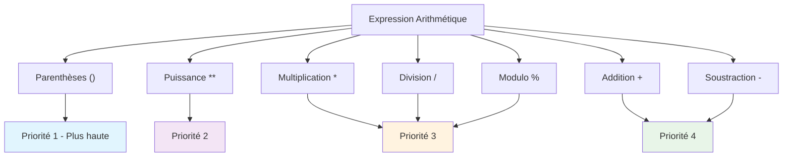
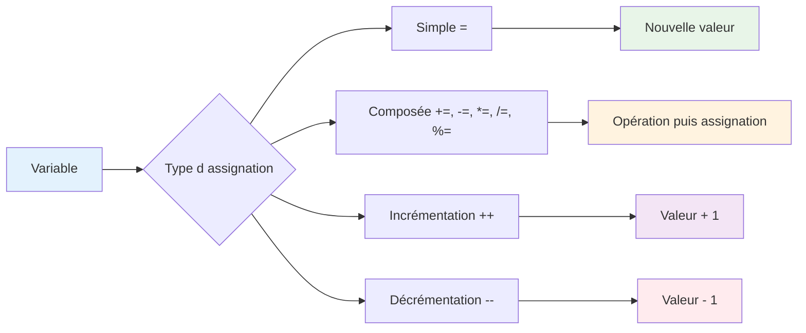
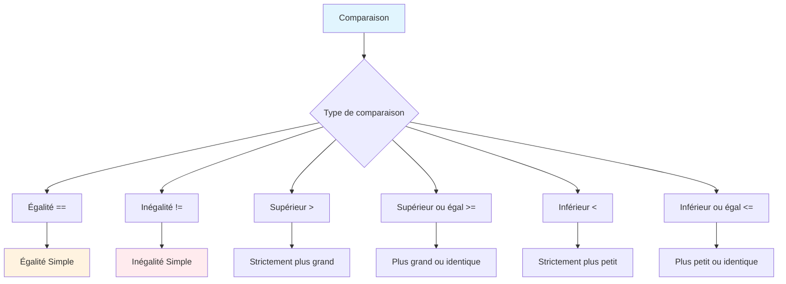
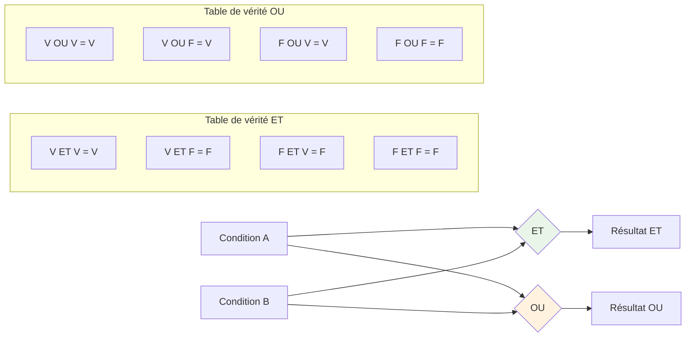
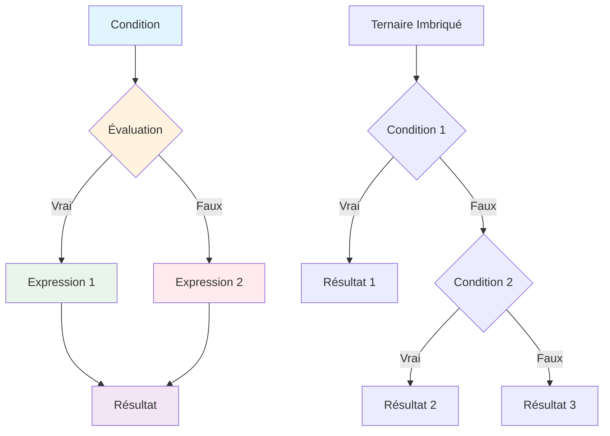
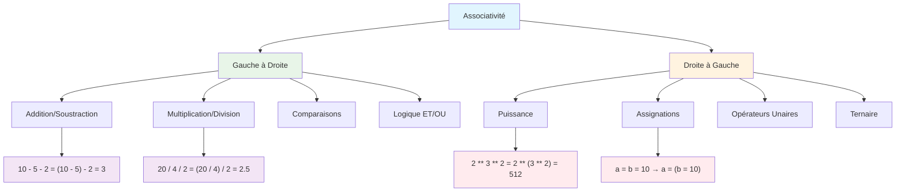
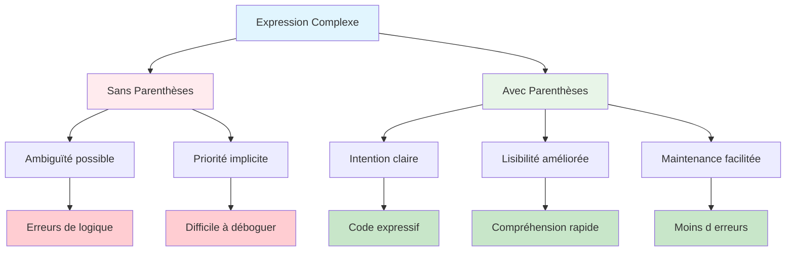
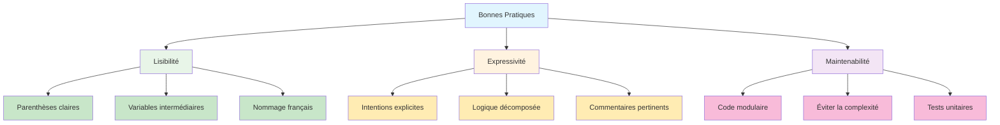
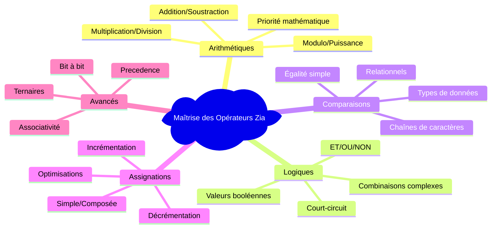

# Opérateurs Arithmétiques et Logiques
## L'algèbre française en programmation

> *"Les opérateurs sont les verbes de votre langage algorithmique : ils donnent du mouvement à vos données et transforment vos intentions en actions."*

---

## 🔢 Opérateurs Arithmétiques : l'art du calcul

### **Hiérarchie des opérateurs arithmétiques**



### **Les quatre opérations fondamentales**

Zia respecte les conventions mathématiques françaises tout en offrant une syntaxe claire et intuitive :

```zia
var a = 15;
var b = 4;

var addition = a + b;        // 19 - L'union des nombres
var soustraction = a - b;    // 11 - La différence révélée
var multiplication = a * b;  // 60 - La puissance du produit
var division = a / b;        // 3.75 - La précision du quotient
```

### **Division : intelligence contextuelle**

Zia gère intelligemment les divisions selon le contexte français :

```zia
var prixTotal = 100;
var nombrePersonnes = 3;

var partParPersonne = prixTotal / nombrePersonnes;  // 33.333... (décimal automatique)
afficher "Chaque personne paie : ", partParPersonne, "€";

// Division entière explicite
var quotientEntier = plancher(prixTotal / nombrePersonnes);  // 33
var reste = prixTotal % nombrePersonnes;                       // 1
afficher "Division : ", quotientEntier, " reste ", reste;
```

### **Modulo : le reste français**

L'opérateur modulo (`%`) révèle le reste d'une division :

```zia
var annee = 2024;
var estBissextile = (annee % 4 == 0) et (annee % 100 != 0 ou annee % 400 == 0);
afficher estBissextile, "\n";

var numeroSemaine = 15;
var jourSemaine = numeroSemaine % 7;  // 0=Lundi, 1=Mardi, etc.
afficher jourSemaine, "\n";

var nombre = 17;
var estPair = (nombre % 2 == 0);      // faux
afficher estPair, "\n";

var estImpair = (nombre % 2 == 1);    // vrai
afficher estImpair, "\n";
```

### **Puissance et racines : mathématiques avancées**

```zia
var base = 2;
var exposant = 8;
var puissance = base ** exposant;     // 256 - Opérateur puissance moderne

afficher puissance;
```

---

## 📊 Opérateurs d'assignation : l'élégance de l'attribution

### **Flux d'assignation**



### **Assignation simple et composée**

```zia
var compteur = 0;

// Assignations composées - l'efficacité française
compteur += 5;    // compteur = compteur + 5  (maintenant 5)
compteur -= 2;    // compteur = compteur - 2  (maintenant 3)
compteur *= 3;    // compteur = compteur * 3  (maintenant 9)
compteur /= 3;    // compteur = compteur / 3  (maintenant 3)

afficher "Compteur final : ", compteur;
```

### **Incrémentation et décrémentation**

```zia
var visiteurs = 100;

visiteurs++;      // Post-incrémentation : visiteurs devient 101
afficher visiteurs, "\n";

++visiteurs;      // Pré-incrémentation : visiteurs devient 102
afficher visiteurs, "\n";

visiteurs--;      // Post-décrémentation : visiteurs devient 101
afficher visiteurs, "\n";

--visiteurs;      // Pré-décrémentation : visiteurs devient 100
afficher visiteurs, "\n";

// Utilisation dans des contextes
var i = 0;
var limite = 5;

tantque (i < limite) {
    afficher "\nÉtape ", i;
    i++;  // Incrémentation pour avancer
}
```

---

## 🎯 Opérateurs de comparaison : l'art du jugement

### **Arbre de décision des comparaisons**



### **Égalité et inégalité**

```zia
var age = 18;
var majorite = 18;

// Égalité - la reconnaissance
var estMajeur = (age == majorite);          // vrai
afficher estMajeur, "\n";

var nEstPasMajeur = (age != majorite);      // faux
afficher nEstPasMajeur, "\n";

// Égalité simple - la précision absolue
var nombre = 5;
var texte = "5";
var egaliteSouple = (nombre == texte);      // faux (types différents)
afficher egaliteSouple, "\n";
```

### **Comparaisons numériques**

```zia
var note = 14.5;
var noteMoyenne = 10;
var noteExcellence = 16;

var estRecu = (note >= noteMoyenne);        // vrai
afficher estRecu, "\n";

var estBrillant = (note > noteExcellence);  // faux
afficher estBrillant, "\n";

var peutMieux = (note < noteExcellence);    // vrai
afficher peutMieux, "\n";

var peutMieux = (note <= 8);             // faux
afficher peutMieux, "\n";
```

---

## 🧠 Opérateurs logiques : la logique française

### **Diagramme de logique booléenne**



### **ET, OU : la trinité logique**

```zia
var age = 25;
var aPermis = vrai;
var estAssurance = vrai;

// ET logique (&&) - toutes les conditions doivent être vraies
var peutConduire = (age >= 18) et aPermis et estAssurance;  // vrai
afficher peutConduire;

afficher "\n";

// OU logique (||) - au moins une condition doit être vraie
var peutVoter = (age >= 18) ou (age >= 16 et estCitoyen);
afficher peutVoter;

```

---

## 🔀 Opérateurs ternaires : la concision élégante

### **Flux conditionnel ternaire**



### **Condition ? Vrai : Faux**

```zia
var age = 17;
var statut = (age >= 18) ? "Majeur" : "Mineur";
afficher "Statut : " + statut;  // "Statut : Mineur"

var note = 15;
var mention = (note >= 16) ? "Très bien" : 
              (note >= 14) ? "Bien" : 
              (note >= 12) ? "Assez bien" : 
              (note <= 10) ? "Passable" : "Insuffisant";
afficher "\nMention : ", mention;  // "Mention : Bien"

var temperature = 22;
var conseil = (temperature > 25) ? "Portez des vêtements légers" :
              (temperature > 15) ? "Une veste légère suffira" :
              "N'oubliez pas votre manteau";
afficher "\nConseil : ", conseil;  // "Conseil : Une veste légère suffir"
```

---

## 🎯 Priorité des opérateurs : l'ordre français

### **Hiérarchie complète des opérations**

La priorité des opérateurs en Zia suit une logique mathématique et française rigoureuse. Comprendre cette hiérarchie est essentiel pour écrire des expressions correctes et prévisibles.


| Niveau | Opérateur | Description | Associativité | Exemple |
|--------|-----------|-------------|---------------|---------|
| 1 | `()` | Groupement | Gauche à droite | `(a + b)` |
| 2 | `++` `--` (post) | Post-incrémentation | Gauche à droite | `a++` `b--` |
| 3 | `++` `--` (pré) `+` `-` `!` | Unaires | Droite à gauche | `++a` `-x` `!valid` |
| 4 | `**` | Puissance | Droite à gauche | `2 ** 3 ** 2` = `2 ** 9` |
| 5 | `*` `/` `%` | Multiplicatifs | Gauche à droite | `a * b / c` |
| 6 | `+` `-` | Additifs | Gauche à droite | `a + b - c` |
| 8 | `<` `<=` `>` `>=` | Relationnels | Gauche à droite | `a < b <= c` |
| 9 | `==` `!=` | Égalité | Gauche à droite | `a == b != c` |
| 13 | `&&` `et` | ET logique | Gauche à droite | `a et b et c` |
| 14 | `||` `ou` | OU logique | Gauche à droite | `a ou b ou c` |
| 15 | `? :` | Ternaire | Droite à gauche | `a ? b : c ? d : e` |
| 16 | `=` `+=` `-=` `*=` `/=` | Assignation | Droite à gauche | `a = b += c` |
| 17 | `,` | Virgule | Gauche à droite | `a, b, c` |

### **Exemples détaillés avec évaluation étape par étape**

```zia
// Exemple 1 : Arithmétique mixte
var resultat1 = 2 + 3 * 4 ** 2;
afficher resultat1, "\n";
// Étape 1 : 4 ** 2 = 16        (puissance en premier)
// Étape 2 : 3 * 16 = 48        (multiplication)
// Étape 3 : 2 + 48 = 50        (addition)
// Résultat : 50

// Exemple 2 : Comparaisons et logique
var resultat2 = 5 + 3 > 7 et 10 / 2 == 5;
afficher resultat2, "\n";
// Étape 1 : 5 + 3 = 8          (addition)
// Étape 2 : 10 / 2 = 5         (division)
// Étape 3 : 8 > 7 = vrai       (comparaison)
// Étape 4 : 5 == 5 = vrai      (égalité)
// Étape 5 : vrai et vrai = vrai (ET logique)
// Résultat : vrai

// Exemple 3 : Assignations composées
var a = 5;
var b = 2;
var c = a += b *= 3;
afficher c, "\n";
// Étape 1 : b *= 3 → b = 2 * 3 = 6    (assignation droite à gauche)
// Étape 2 : a += 6 → a = 5 + 6 = 11   (assignation)
// Étape 3 : c = 11                     (assignation finale)
// Résultats : a=11, b=6, c=11
```

### **Associativité : l'ordre d'évaluation**



```zia
// Associativité gauche à droite (la plupart des opérateurs)
var calcul1 = 10 - 5 - 2;
afficher calcul1, "\n";
// Évaluation : (10 - 5) - 2 = 5 - 2 = 3

var calcul2 = 20 / 4 / 2;
afficher calcul2, "\n";
// Évaluation : (20 / 4) / 2 = 5 / 2 = 2.5

// Associativité droite à gauche (puissance, assignation, ternaire)
var puissance = 2 ** 3 ** 2;
afficher puissance, "\n";
// Évaluation : 2 ** (3 ** 2) = 2 ** 9 = 512

var a = 0;
var b = 0;
var c = 0;
var assignation = a = b = c = 10;
afficher assignation, "\n";
// Évaluation : a = (b = (c = 10))
// Résultat : a=10, b=10, c=10

var ternaire = a > 0 ? (b > 0 ? "double positif" : "a positif, b negatif") : "a negatif";
afficher ternaire, "\n";
// Évaluation : a > 0 ? (b > 0 ? "double positif" : "a positif, b negatif") : "a negatif"
```

### **Utilisation stratégique des parenthèses**



```zia
var taxe = 9.98;
var prix = 999.99;
var quantite = 3;

// Sans parenthèses - peut être ambigu
var calcul = prix * quantite + taxe / 100;
afficher calcul, "\n";
// Évaluation : prix * quantite + (taxe / 100)

// Avec parenthèses - intention claire
var calculClair = (prix * quantite) + (taxe / 100);
afficher calculClair, "\n";
var calculAlternatif = prix * (quantite + taxe) / 100;
afficher calculAlternatif, "\n";

// Logique complexe clarifiée
var age = 23;
var aPermis = vrai;
var supervise = vrai;
var condition = (age >= 18 et aPermis) ou (age >= 16 et supervise);
afficher condition, "\n";
// vs
var conditionAmbigue = age >= 18 et aPermis ou age >= 16 et supervise;
afficher conditionAmbigue, "\n";
// Cette dernière évalue comme : (age >= 18 et aPermis) ou (age >= 16 et supervise)
// mais c'est moins clair

```

### **Fonctions utilitaires pour déboguer la precedence**

```zia
fonction demonstrerPriorites() {
    var a = 2;
    var b = 3;
    var c = 4;
    var d = 5;

    // Tests de priorité avec calculs manuels
    var test1 = a + b * c;              // 2 + 3 * 4 = 2 + 12 = 14
    var test2 = (a + b) * c;            // (2 + 3) * 4 = 5 * 4 = 20
    var test3 = a < b et c > d;         // 2 < 3 et 4 > 5 = vrai et faux = faux
    var test4 = a + b > c ou d == a + b; // 2 + 3 > 4 ou 5 == 2 + 3 = 5 > 4 ou 5 == 5 = vrai ou vrai = vrai

    afficher "\na + b * c = ", test1;
    afficher "\n(a + b) * c = ", test2;
    afficher "\na < b et c > d = ", test3;
    afficher "\na + b > c ou d == a + b = ", test4;
}

demonstrerPriorites();
```

---

## 🌟 Bonnes pratiques françaises

### **Lisibilité et expressivité**



```zia
// ✅ Utilisation claire des parenthèses
var prixHT = 89; var tauxTVA = 23;
var prixTTC = (prixHT * (1 + tauxTVA / 100));
afficher prixTTC, "\n";

// ✅ Variables intermédiaires pour la clarté
var age = 17;
var permis;
var estMajeur = (age >= 18);
var aPermis = (permis != nul);
var peutConduire = estMajeur et aPermis;
afficher peutConduire, "\n";

// ❌ Éviter les expressions trop complexes
var a = 2; var b = 3; var c = 4;
var d = 5; var e = 6; var f = 7;
var g = 8; var h = 9; var i = 19;
var j = 20;

var resultat = ((a > b) ? (c + d) : (e - f)) * ((g < h) ? i : j);
afficher resultat, "\n";
// ✅ Préférer la décomposition
var condition1 = (a > b);
var valeur1 = condition1 ? (c + d) : (e - f);
var condition2 = (g < h);
var valeur2 = condition2 ? i : j;
var resultat = valeur1 * valeur2;
afficher resultat, "\n";
```

### **Tests et validation**

```zia
fonction testerOperateurs() {
    afficher "=== Tests des Opérateurs Zia ===";

    // Test 1 : Priorité arithmétique
    var test1 = 2 + 3 * 4;
    var attendu1 = 14;
    var resultat1 = (test1 == attendu1) ? "PASS" : "FAIL";
    afficher "\nTest priorité arithmétique : " + resultat1;

    // Test 2 : Logique avec court-circuit
    var test2 = faux et (1 / 0 > 0); // Ne devrait pas lever d'erreur
    var resultat2 = (test2 == faux) ? "PASS" : "FAIL";
    afficher "\nTest court-circuit ET : ", resultat2;

    // Test 3 : Opérateur ternaire
    var age = 20;
    var test3 = (age >= 18) ? "majeur" : "mineur";
    var resultat3 = (test3 == "majeur") ? "PASS" : "FAIL";
    afficher "\nTest ternaire : ", resultat3;

    // Test 4 : Assignation composée
    var compteur = 10;
    compteur += 5;
    compteur *= 2;
    var test4 = compteur;
    var attendu4 = 30; // (10 + 5) * 2
    var resultat4 = (test4 == attendu4) ? "PASS" : "FAIL";
    afficher "\nTest assignation composée : ", resultat4;

    // Test 5 : Comparaisons de chaînes
    var test5 = "alice" == "bernard";
    var resultat5 = test5 ? "PASS" : "FAIL";
    afficher "\nTest comparaison chaînes : ", resultat5;

    afficher "\n=== Fin des tests ===";
}

testerOperateurs();
```

---

## 🚀 Vers la maîtrise opérationnelle

### **Synthèse des concepts clés**



Les opérateurs en Zia ne sont pas de simples symboles : ils sont les outils qui donnent vie à vos données et transforment vos idées en logique exécutable. En maîtrisant leur utilisation, vous acquérez la capacité d'exprimer n'importe quelle transformation mathématique ou logique avec l'élégance et la précision qui caractérisent la programmation française.

### **Récapitulatif des bonnes pratiques**

1. **Clarté avant tout** : Utilisez des parenthèses pour rendre vos intentions explicites
2. **Nommage expressif** : Choisissez des noms de variables qui révèlent leur purpose
3. **Décomposition logique** : Préférez plusieurs étapes simples à une expression complexe
4. **Gestion des erreurs** : Anticipez les cas limites et les valeurs inattendues
5. **Tests réguliers** : Vérifiez le comportement de vos opérations avec des exemples concrets

### **Évolution continue**

Chaque opérateur a sa personnalité, sa priorité, et son rôle dans l'orchestre de votre code. Utilisez-les avec discernement, clarté, et n'hésitez jamais à privilégier la lisibilité sur la concision quand cela sert la compréhension.

---

*Les opérateurs sont les verbes de votre vocabulaire algorithmique : conjuguez-les avec sagesse pour créer des programmes qui chantent en français.*