# Syntaxe
## Les règles grammaticales de Zia

> *"La syntaxe d'un langage de programmation est comme la grammaire d'une langue vivante : elle donne structure et sens à nos pensées créatrices."*

---

## 🎭 L'élégance française dans le code

Imaginez pouvoir écrire du code avec la même fluidité que vous rédigez une lettre en français. C'est exactement ce que propose Zia : une syntaxe qui respecte non seulement les règles techniques de la programmation, mais aussi l'esprit et la logique de la langue française.

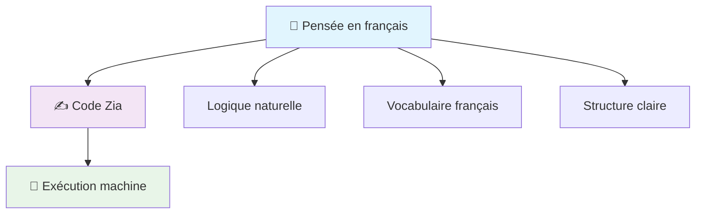

Zia hérite de la robustesse structurelle du langage C tout en substituant ses mots-clés anglais par leurs équivalents français naturels. Cette approche crée une harmonie unique entre la rigueur algorithmique et l'élégance linguistique française.

---

## 🗝️ Le vocabulaire fondamental de Zia

### **Les mots-clés : votre palette d'expression**

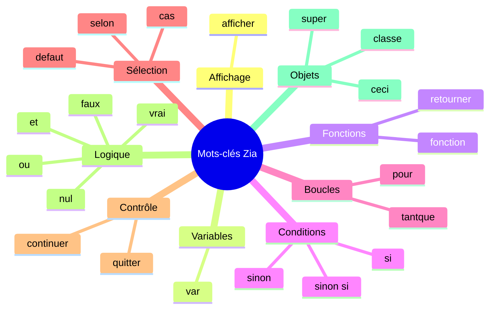

Chaque mot-clé de Zia a été soigneusement sélectionné pour respecter l'usage français tout en conservant la précision technique nécessaire. Voici votre vocabulaire de base :

| **Mot-clé Zia** | **Rôle et nuance** | **Équivalent technique** |
|-----------------|-------------------|-------------------------|
| `afficher` | *Révéler, présenter au monde* | print/printf |
| `var` | *Déclarer l'existence d'une donnée* | var/let |
| `fonction` | *Créer un bloc d'actions réutilisable* | function |
| `retourner` | *Renvoyer un résultat vers l'appelant* | return |
| `si` | *Introduire une condition* | if |
| `sinon si` | *Condition alternative* | else if |
| `sinon` | *Action alternative* | else |
| `pour` | *Itération déterminée* | for |
| `tantque` | *Répétition conditionnelle* | while |
| `selon` | *Sélection parmi plusieurs cas* | switch |
| `cas` | *Option spécifique dans une sélection* | case |
| `defaut` | *Cas par défaut dans une sélection* | default |
| `quitter` | *Sortir d'une boucle ou d'un bloc* | break |
| `continuer` | *Passer à l'itération suivante* | continue |
| `et` | *Conjonction logique inclusive* | and/&& |
| `ou` | *Disjonction logique* | or/\|\| |
| `vrai` | *Valeur de vérité positive* | true |
| `faux` | *Valeur de vérité négative* | false |
| `nul` | *Absence de valeur* | null |
| `classe` | *Modèle d'objet* | class |
| `ceci` | *Référence à l'instance courante* | this |
| `super` | *Référence à la classe parente* | super |

### **La poésie des mots choisis**

Chaque terme français de Zia porte en lui une richesse sémantique qui dépasse la simple traduction :

- **`afficher`** évoque l'idée de montrer fièrement, comme on affiche ses couleurs
- **`retourner`** suggère un voyage de la donnée qui revient vers son origine
- **`tantque`** exprime la persistence dans le temps, la continuation d'un état
- **`sinon`** apporte cette nuance française de l'alternative courtoise
- **`selon`** introduit une analyse méthodique des possibilités
- **`defaut`** représente le choix de sagesse quand rien d'autre ne convient
- **`quitter`** évoque la sortie élégante, l'abandon maîtrisé
- **`continuer`** exprime la persévérance, l'élan vers l'avant

---

## 🏗️ Architecture d'un programme Zia

### **Structure générale : la logique française**

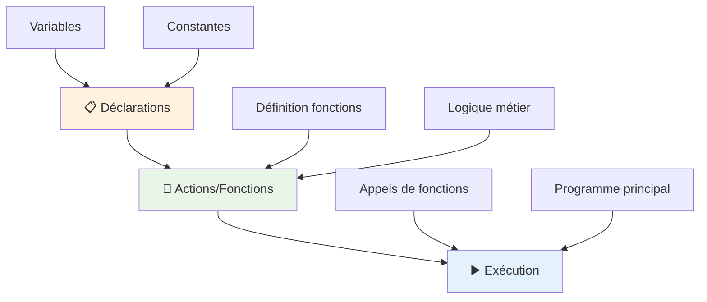

Un programme Zia suit une architecture claire qui respecte l'ordre naturel de la pensée française :

```zia
// Déclarations (ce que nous possédons)
var message = "Bonjour Zia !";
var compteur = 0;

// Actions (ce que nous faisons)
fonction saluer() {
    afficher message;
    compteur = compteur + 1;
}

// Exécution (ce que nous accomplissons)
saluer();
```

### **Les commentaires : vos notes personnelles**

Zia supporte naturellement les commentaires français avec les accents :

```zia
// Ceci est un commentaire sur une ligne
/* Ceci est un commentaire
   sur plusieurs lignes
   parfait pour les explications détaillées */

var age = 25;
```

---

## 📦 Variables : donner vie aux données

### **Déclaration : l'acte de naissance des données**

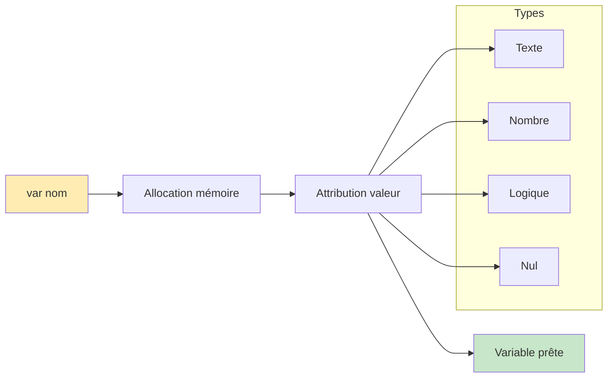

En Zia, créer une variable, c'est donner naissance à un concept dans l'univers de votre programme :

```zia
var nom = "Marie";           // Une identité textuelle
var age = 28;                // Un nombre entier
var taille = 1.65;           // Un nombre décimal
var estEtudiante = vrai;     // Une vérité logique
var hobby = nul;             // Une valeur encore indéterminée
```

### **Conventions de nommage à la française**

Zia encourage l'utilisation de noms expressifs en français :

```zia
// ✅ Style français recommandé
var nombreDEtudiants = 42;
var moyenneGenerale = 15.8;
var estConnecte = faux;

```

### **Types de données : la richesse de l'expression**

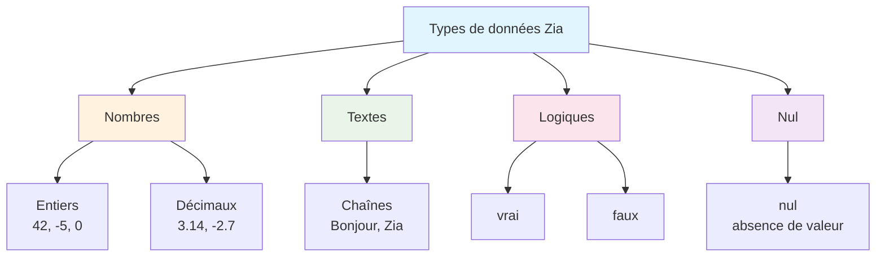

```zia
// Nombres entiers
var population = 67000000;
var temperature = -5;

// Nombres décimaux
var pi = 3.14159;
var pourcentage = 87.5;

// Textes (chaînes de caractères)
var citation = "La programmation est un art";
var email = "contact@exemple.fr";

// Valeurs logiques
var estValide = vrai;
var estTermine = faux;

// Valeur nulle
var resultat = nul; // En attente d'une valeur
```

---

## 🎯 Structures de contrôle : la logique en action

### **Conditions : l'art de décider**

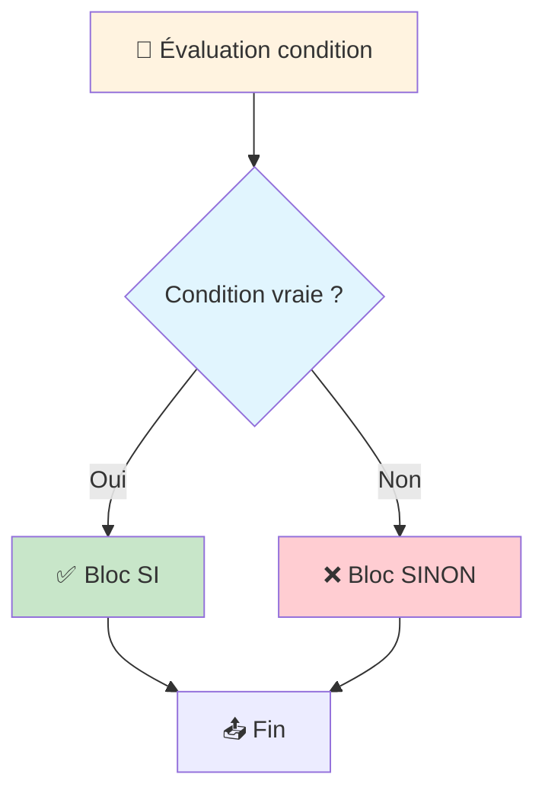

La structure conditionnelle en Zia reflète la logique française naturelle :

```zia
var note = 16;

si (note >= 10) {
    afficher "Félicitations, vous êtes reçu !";
} sinon {
    afficher "Courage, vous pouvez réessayer.";
}
```

### **Conditions complexes : nuancer la pensée**

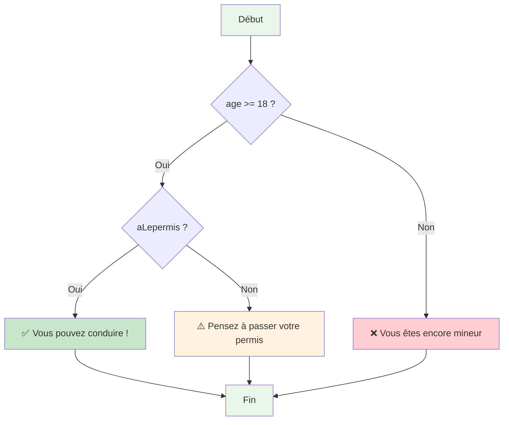

```zia
var age = 25;
var aLepermis = vrai;

si (age >= 18 et aLepermis) {
    afficher "Vous pouvez conduire !";
} sinon si (age >= 18) {
    afficher "Pensez à passer votre permis.";
} sinon {
    afficher "Vous êtes encore mineur.";
}
```

### **Sélection multiple : l'élégance du `selon-cas`**

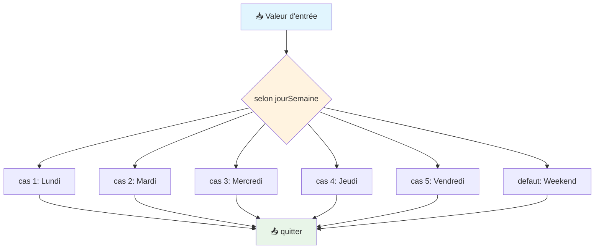

Pour les situations où plusieurs choix s'offrent à vous, Zia propose la structure `selon-cas` :

```zia
var jourSemaine = 3;

selon (jourSemaine) {
    cas 1:
        afficher "Lundi - Début de semaine !";
        quitter;
    
    cas 2:
        afficher "Mardi - On continue !";
        quitter;
    
    cas 3:
        afficher "Mercredi - Milieu de semaine";
        quitter;
        
    cas 4:
        afficher "Jeudi - Bientôt le weekend";
        quitter;
        
    cas 5:
        afficher "Vendredi - Dernier jour !";
        quitter;
        
    defaut:
        afficher "Weekend - Repos bien mérité !";
}
```

### **Boucles : la répétition maîtrisée**

#### **La boucle `pour` - itération déterminée :**

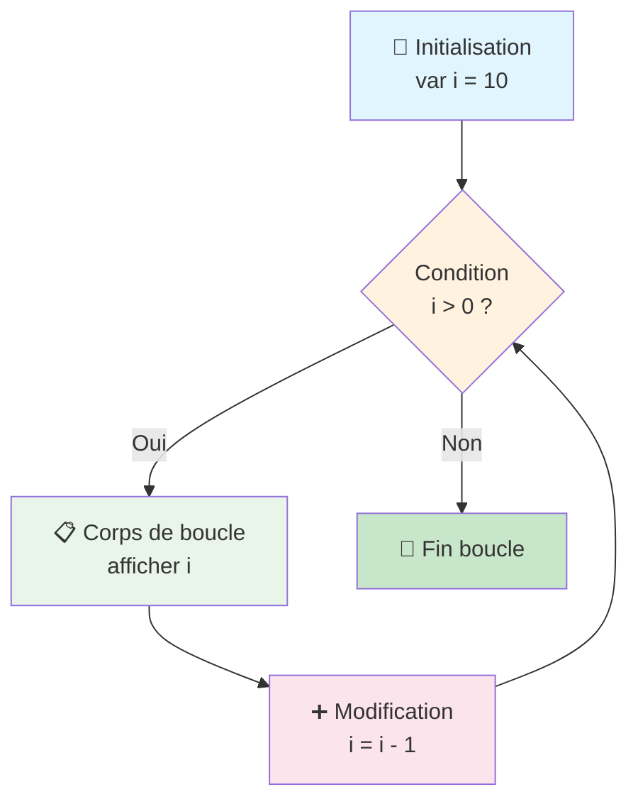

```zia
afficher "Compte à rebours :";
pour (var i = 10; i > 0; i = i - 1) {
    afficher i;
}
afficher "Décollage !";
```

#### **La boucle `tantque` - persévérance conditionnelle :**

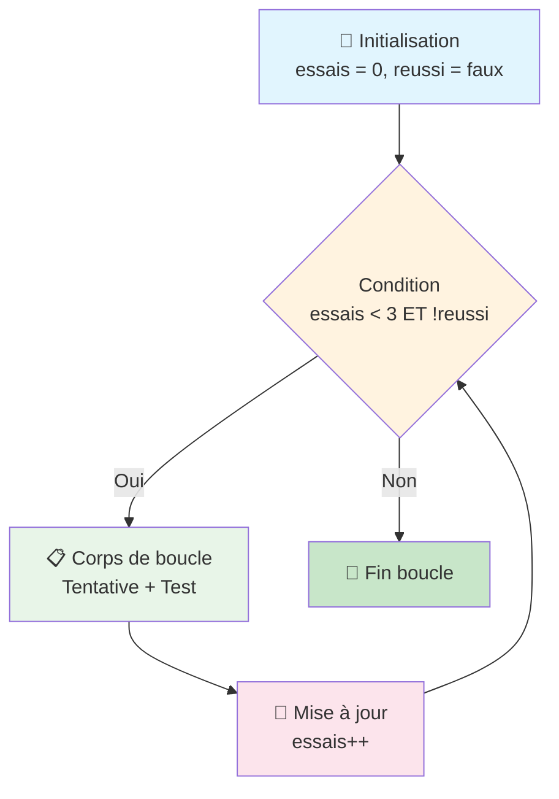

```zia
var essais = 0;
var reussi = faux;

tantque (essais < 3 et !reussi) {
    afficher "Tentative numéro : ", (essais + 1);
    // Simulation d'un test
    reussi = (essais == 2); // Réussit à la 3ème tentative
    essais = essais + 1;
}
```

### **Contrôle de flux : `quitter` et `continuer`**

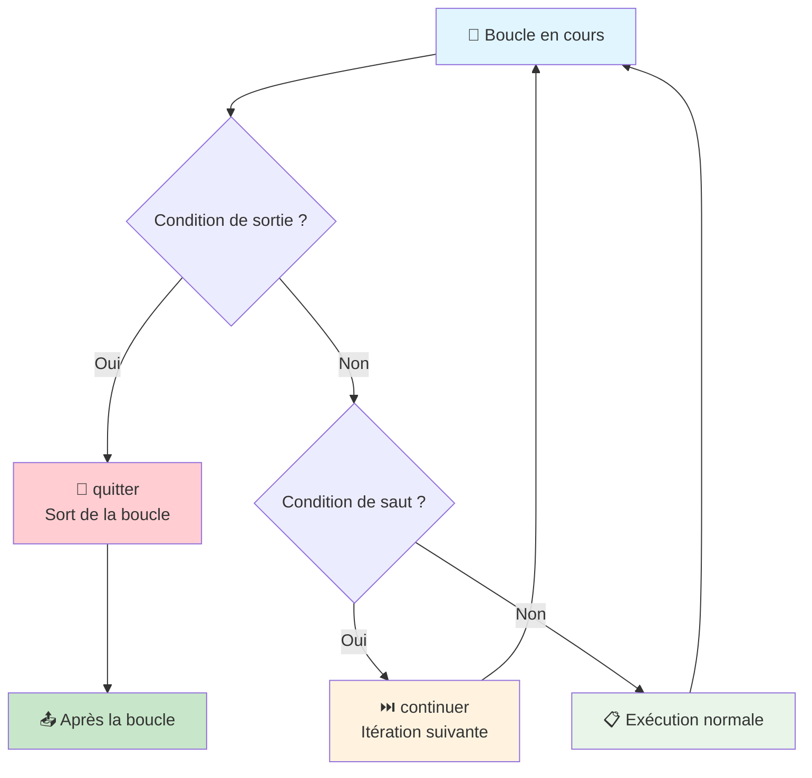

**Utilisation de `quitter` dans une boucle :**

```zia
var compteur = 0;

tantque (vrai) {
    si (compteur > 5) {
        afficher "Arrêt de la boucle !";
        quitter; // Sort de la boucle tantque
    }
    
    afficher "Compteur : ", compteur;
    compteur = compteur + 1;
}

afficher "Fin du programme.";
```

**Utilisation de `continuer` pour passer à l'itération suivante :**

```zia
afficher "Nombres pairs de 1 à 10 :";

pour (var i = 1; i <= 10; i = i + 1) {
    si (i % 2 != 0) {
        continuer; // Passe à l'itération suivante si impair
    }
    
    afficher i; // Affiche seulement les nombres pairs
}
```

## 🔧 Fonctions : la modularité élégante

### **Architecture des fonctions**

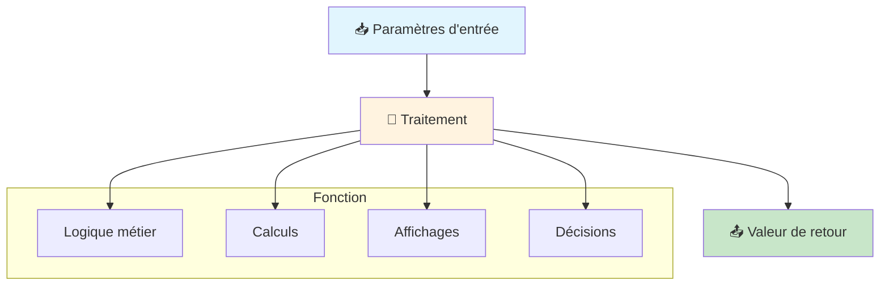

### **Définition : créer ses propres actions**

```zia
fonction direBonjour(prenom) {
    afficher "Bonjour " + prenom + " !";
    afficher " Comment allez-vous ?";
}

fonction calculerAire(longueur, largeur) {
    var aire = longueur * largeur;
    retourner aire;
}

```

### **Utilisation : donner vie aux fonctions**

```zia
// Appels simples
direBonjour("Sophie");
direBonjour("Thomas");

// Utilisation avec valeur de retour
var surfaceSalon = calculerAire(5.2, 4.8);
afficher "La surface du salon est : ", surfaceSalon, " m²";
```

---

## 🎨 Exemples pratiques : l'art en action

### **Programme calculatrice simple**

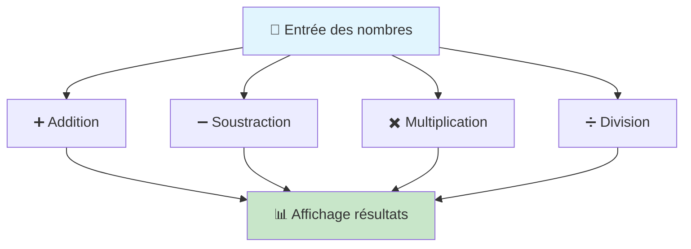

```zia
fonction calculatrice() {
    var nombre1 = 15;
    var nombre2 = 7;
    
    afficher "=== Calculatrice Zia ===";
    afficher "Premier nombre : ", nombre1;
    afficher "Second nombre : ", nombre2;
    
    afficher "Addition : ", (nombre1 + nombre2);
    afficher "Soustraction : ", (nombre1 - nombre2);
    afficher "Multiplication : ", (nombre1 * nombre2);
    afficher "Division : ", (nombre1 / nombre2);
}

calculatrice();
```

### **Menu interactif avec selon-cas**

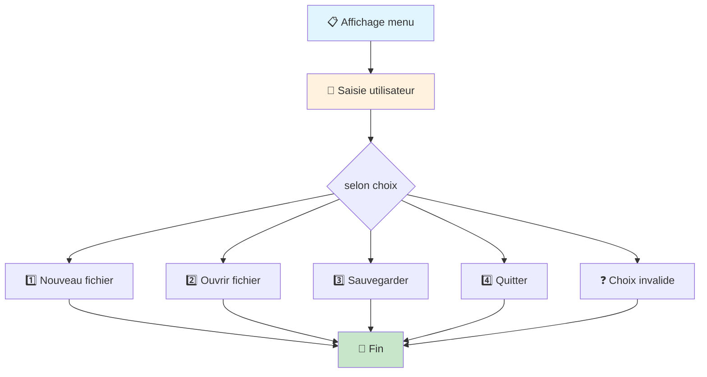

```zia
fonction menuPrincipal() {
    var choix = 2; // Simuler un choix utilisateur

    afficher "\n=== Menu Principal ===";
    afficher "\n1. Nouveau fichier";
    afficher "\n2. Ouvrir fichier";
    afficher "\n3. Sauvegarder";
    afficher "\n4. Quitter";

    selon (choix) {
        cas 1:
            afficher "\nCréation d'un nouveau fichier...";
            quitter;

        cas 2:
            afficher "\nOuverture d'un fichier existant...";
            quitter;

        cas 3:
            afficher "\nSauvegarde en cours...";
            quitter;

        cas 4:
            afficher "\nAu revoir !";
            quitter;

        defaut:
            afficher "\nChoix invalide. Veuillez réessayer.";
    }
}

menuPrincipal();
```

### **Recherche avec contrôle de flux**

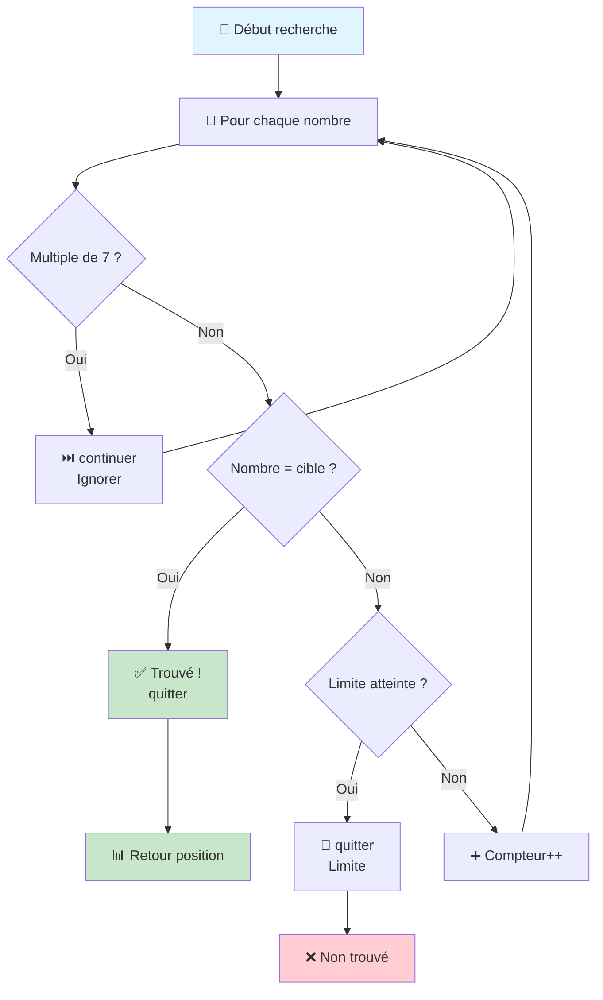

```zia
fonction rechercherNombre(cible) {
    var trouve = faux;
    var position = -1;
    var compteur = 1;

    // Simuler une série de nombres à examiner
    pour (var nombre = 10; nombre <= 50; nombre = nombre + 3) {
        si (nombre % 7 == 0) {
            afficher "\nMultiple de 7 ignoré : ", nombre;
            continuer; // Ignorer les multiples de 7
        }

        afficher "\nVérification du nombre : ", nombre;

        si (nombre == cible) {
            trouve = vrai;
            position = compteur;
            afficher "\nNombre trouvé ! Position : ", position;
            quitter; // Sortir dès qu'on trouve
        }

        compteur = compteur + 1;

        // Limiter la recherche pour éviter une boucle infinie
        si (compteur > 10) {
            afficher "\nLimite de recherche atteinte";
            quitter;
        }
    }

    si (!trouve) {
        afficher "\nNombre ", cible, " non trouvé dans la séquence.";
    }

    retourner position;
}

// Test de la fonction
var resultat = rechercherNombre(25);
afficher "\nRésultat de la recherche : ", resultat;

```

---

### 🌟 **Logique de lecture naturelle**

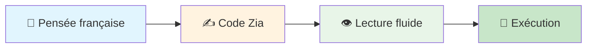

Zia privilégie la lecture fluide, presque littéraire :

```zia
var utilisateur = "Pierre";
var estConnecte = vrai;

si (utilisateur != nul et estConnecte) {
    afficher "Bienvenue ", utilisateur, " !";
    afficher "Vous êtes maintenant connecté.";
} sinon {
    afficher "Veuillez vous connecter.";
}
```

---

## 🎓 Règles de style recommandées

### **Architecture de code propre**

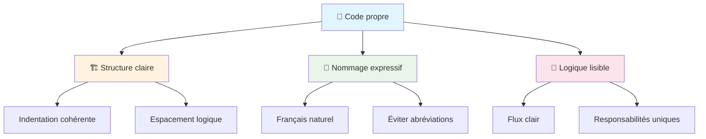

### **Indentation : la respiration du code**

```zia
fonction exempleIndentation() {
    var condition = vrai;
    
    si (condition) {
        afficher "Première ligne indentée";
        
        si (condition) {
            afficher "Seconde niveau d'indentation";
        }
    }
}
```

### **Nommage : la clarté française**

```zia
// ✅ Noms expressifs et français
var compteurVisiteurs = 0;
var estAuthentifie = faux;

fonction calculerMoyenneClasse(notes) {
    // Code clair et bien nommé
}

// ❌ Éviter les abréviations obscures
var cptVst = 0;        // Pas assez clair
var lstEtd = nul;       // Difficile à comprendre
```

### **Usage optimal des structures de contrôle**

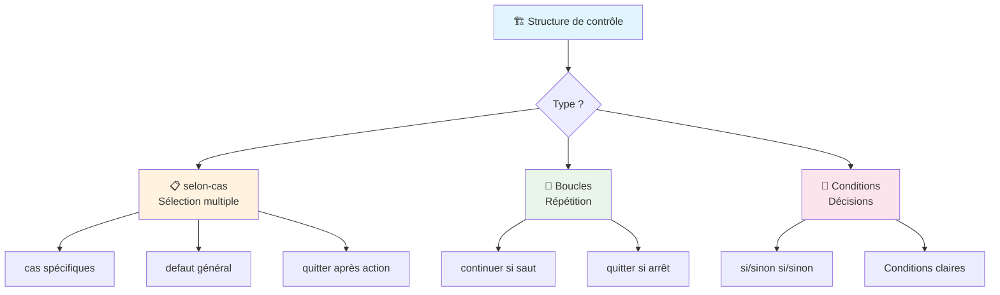

```zia
// ✅ Bon usage de selon-cas
selon (typeUtilisateur) {
    cas "admin":
        // Actions d'administration
        quitter;
    cas "moderateur":
        // Actions de modération
        quitter;
    cas "utilisateur":
        // Actions utilisateur standard
        quitter;
    defaut:
        // Gestion des cas non prévus
}

// ✅ Bon usage de quitter et continuer
pour (var nombre = 1; nombre <= 20; nombre = nombre + 1) {
    si (nombre % 2 == 0) {
        continuer; // Ignorer les nombres pairs
    }
    
    si (nombre > 15) {
        afficher "Limite atteinte !";
        quitter; // Arrêter le traitement
    }
    
    // Traitement des nombres impairs inférieurs à 15
    afficher "Nombre impair : ", nombre;
}
```

---

## 🚀 Vers la maîtrise syntaxique

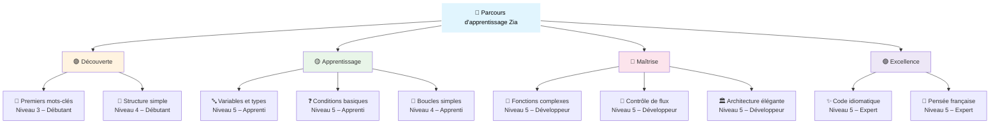

La syntaxe de Zia n'est pas qu'un ensemble de règles techniques : c'est un langage d'expression qui vous permet de traduire vos idées en instructions compréhensibles par la machine, tout en conservant l'élégance et la précision de la programmation française.

Chaque mot-clé, chaque structure, chaque convention a été pensée pour créer une harmonie entre votre pensée naturelle en français et les exigences de la programmation moderne. Les structures de contrôle comme `selon-cas`, `quitter`, et `continuer` vous donnent le pouvoir de créer des programmes qui non seulement fonctionnent efficacement, mais se lisent comme une prose française bien structurée.

En maîtrisant cette syntaxe complète, vous acquérez non seulement les bases techniques nécessaires, mais aussi une nouvelle façon de structurer et d'exprimer vos idées créatrices avec la précision d'un algorithme et l'élégance du français.

Dans le chapitre suivant, nous explorerons en détail les variables et les types de données, approfondissant ainsi votre compréhension des fondements de Zia.

---

*La syntaxe est votre vocabulaire, la logique sera votre grammaire, et la créativité, votre style littéraire dans l'art de programmer en français.*