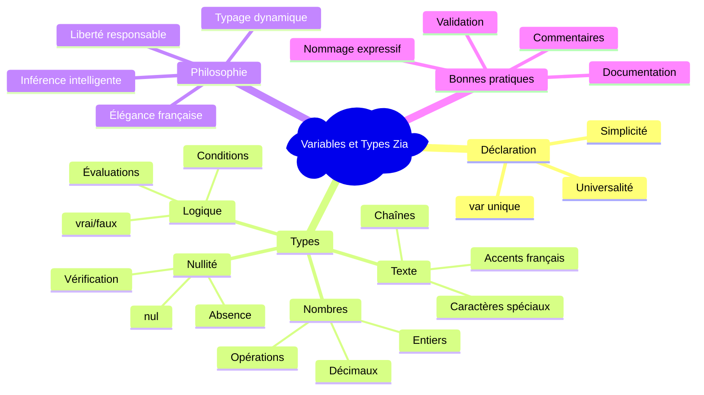
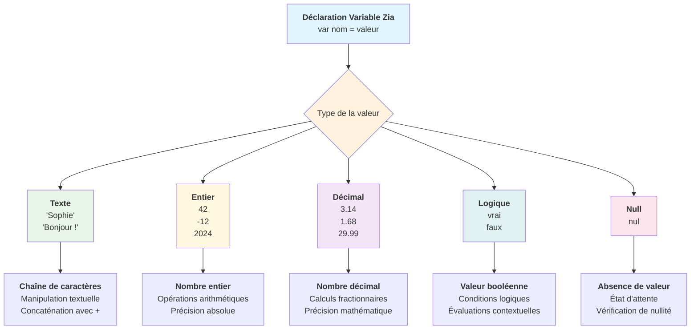
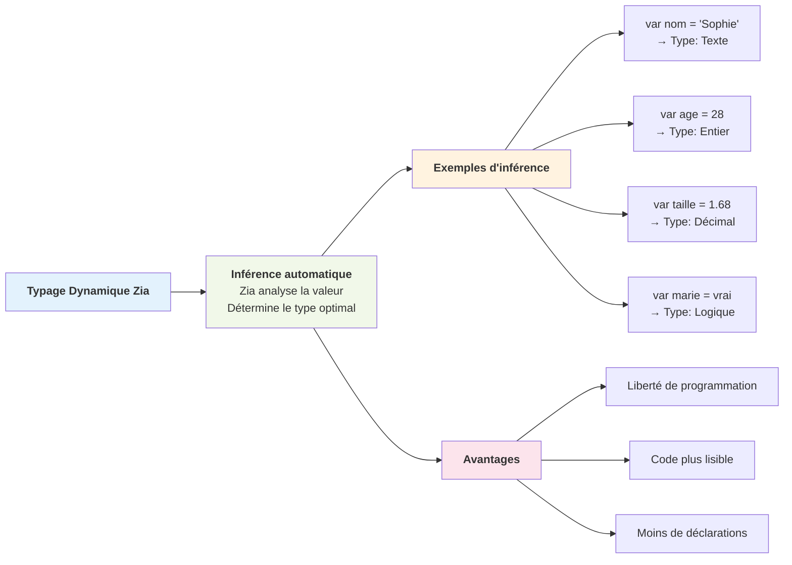
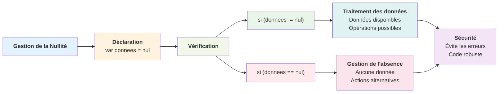
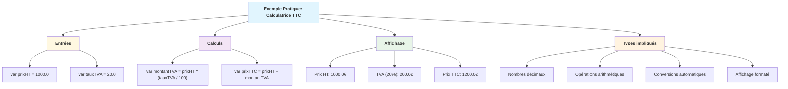
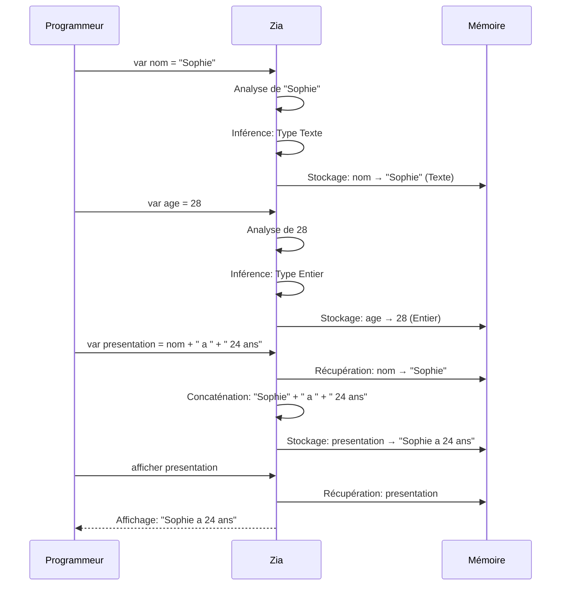

# Variables et Types
## Gestion des données en français

> *"Une variable est comme un tiroir étiquetté dans l'esprit de votre programme : elle garde précieusement vos données en attendant que vous en ayez besoin."*

---

## 🎭 L'art de nommer et typer à la française

Dans l'univers de Zia, chaque donnée est un personnage de votre histoire algorithmique. Les variables sont les noms que vous donnez à ces personnages, et les types définissent leur nature profonde. Cette approche française du typage dynamique vous libère des contraintes rigides tout en préservant la clarté conceptuelle.

Zia adopte une philosophie de **typage dynamique intelligent** : vous n'avez pas besoin de déclarer explicitement le type de vos données, mais le langage comprend intuitivement leur nature et adapte son comportement en conséquence. C'est la liberté dans la structure, l'élégance dans la simplicité.



---

## 🔤 Le mot magique : `var`

### **La déclaration universelle**

En Zia, tous les chemins mènent à `var` - ce mot-clé unique qui ouvre les portes de l'univers des données :

```zia
var nom = "Sophie";          // Zia comprend : "C'est du texte"
var age = 28;                // Zia comprend : "C'est un nombre entier"
var taille = 1.68;           // Zia comprend : "C'est un nombre décimal"
var estMariee = vrai;        // Zia comprend : "C'est une valeur logique"
var enfants = nul;           // Zia comprend : "C'est une absence de valeur"
```

Cette simplicité cache une sophistication remarquable : Zia analyse la valeur que vous assignez et détermine automatiquement le type le plus approprié. C'est ce qu'on appelle l'**inférence de type** - votre programme devient plus intelligent et vous, plus libre.



### **Le processus d'inférence de type**



---

## 🔢 Les nombres : l'arithmétique française

### **Entiers : la précision absolue**

Les nombres entiers en Zia représentent les quantités exactes, sans approximation :

```zia
var populationParis = 2175000;        // Population parisienne
var anneeNaissance = 1995;            // Une année précise
var temperatureHiver = -12;           // Températures négatives supportées
var compteurVisites = 0;              // Point de départ neutre
```

### **Nombres décimaux : la nuance mathématique**

Pour les valeurs qui demandent de la précision fractionnaire :

```zia
var pi = 3.14159265;                  // Constante mathématique
var tauxTVA = 20.0;                   // Pourcentage avec décimale
var moyenneClasse = 14.7;             // Note scolaire française
var prixEssence = 1.89;               // Prix au litre
```

### **Opérations : l'algèbre naturelle**

Zia gère intelligemment les conversions automatiques :

```zia
var base = 10;              // Entier
var coefficient = 1.51;      // Décimal
var resultat = base * coefficient;  // Résultat : 15.1 (décimal)

afficher "Calcul intelligent : ", resultat;
```

---

## 📝 Chaînes de caractères : l'expression textuelle

### **Déclaration : donner vie aux mots**

```zia
var prenom = "Marie-Claire";          // Prénoms composés français
var ville = "Aix-en-Provence";        // Villes avec tirets
var message = "Bonjour à tous !";     // Phrases complètes
var email = "contact@exemple.fr";     // Adresses électroniques
```

### **Caractères spéciaux : la richesse française**

Zia embrasse pleinement l'identité française :

```zia
var poeme = "Être ou ne pas être, telle est la question";
var adresse = "123 rue de la Paix, 75001 Paris";
var exclamation = "Quelle magnifique journée !";
var question = "Comment allez-vous aujourd'hui ?";
```

### **Manipulation textuelle avancée**

```zia
var nom = "Dubois";
var prenom = "Jean";
var nomComplet = prenom + " " + nom;    // Concaténation élégante

var presentation = "Je m'appelle " + nomComplet + " et j'ai " + " 35ans.";
afficher presentation;
```

### **Textes multi-lignes et échappement**

```zia
var citation = "Victor Hugo a dit : \"L'avenir appartient aux enfants.\"";
var chemin = "C:\\Documents\\Projets\\MonFichier.txt";
var poemeCourt = "Roses sont rouges,\nViolettes sont bleues,\nZia est la lumiere,\nEt c'est merveilleux !\n";
```

---

## ✅ Valeurs logiques : la vérité française

### **Vrai et faux : la clarté binaire**

```zia
var estMajeur = vrai;                 // Majorité légale
var aUnPermis = faux;                 // Situation administrative
var estConnecte = vrai;               // État de connexion
var estValide = faux;                 // Validation de données
```

### **Logique contextuelle**

Zia comprend naturellement les contextes logiques français :

```zia
var age = 17;
var estMajeur = (age >= 18);          // Évaluation automatique à 'faux'

var note = 16;
var estRecu = (note >= 10);           // Évaluation automatique à 'vrai'

var temps = "ensoleillé";
var peutSortir = (temps == "ensoleillé");  // Évaluation contextuelle
```

---

## ⭕ La nullité : l'art de l'absence

### **`nul` : quand rien vaut quelque chose**

```zia
var resultat = nul;                   // En attente de calcul
var utilisateur = nul;                // Aucun utilisateur connecté
var erreur = nul;                     // Pas d'erreur détectée
```

### **Gestion intelligente de la nullité**

```zia
var donnees = nul;

si (donnees != nul) {
    afficher "Données disponibles : ", donnees;
} sinon {
    afficher "Aucune donnée n'a été trouvée.";
}
```



---

## 🎯 Exemples pratiques avancés

### **Calculatrice financière française**

```zia
fonction calculerTTC(prixHT, tauxTVA) {
    var montantTVA = prixHT * (tauxTVA / 100);
    var prixTTC = prixHT + montantTVA;

    afficher "\nPrix HT : ",prixHT, "€";
    afficher "\nTVA (", tauxTVA, "%) : ", montantTVA, "€";
    afficher "\nPrix TTC : ", prixTTC, "€";

    retourner prixTTC;
}

var nom = "Ordinateur portable";
var prixHT = 1000.0;
var taux = 20.0;

var total = calculerTTC(prixHT, taux);
afficher "\ntotal: ", total, "\n";
```



### **Exemple complexe avec quitter et continuer:**

```zia
fonction calculerSommeNombres() {
    var somme = 0;
    var compteurPositifs = 0;
    var nombreNegatifs = 0;
    
    pour (var nombre = -5; nombre <= 15; nombre = nombre + 1) {
        // Ignorer la valeur zéro
        si (nombre == 0) {
            afficher "Zéro ignoré";
            continuer;
        }
        
        // Compter et traiter les nombres négatifs
        si (nombre < 0) {
            nombreNegatifs = nombreNegatifs + 1;
            afficher "Nombre négatif détecté : ", nombre;
            
            // Arrêter si trop de nombres négatifs
            si (nombreNegatifs > 3) {
                afficher "Trop de nombres négatifs, arrêt !";
                quitter;
            }
            continuer; // Ignorer ce nombre négatif
        }
        
        // Traiter seulement les nombres positifs
        somme = somme + nombre;
        compteurPositifs = compteurPositifs + 1;
        afficher "Ajout de ", nombre, " à la somme";
    }
    
    afficher "Somme finale : ", somme;
    afficher "Nombres positifs traités : ", compteurPositifs;
}

calculerSommeNombres();
```

---

## 🎨 Bonnes pratiques françaises

### **Nommage expressif et culturel**

```zia
// ✅ Nommage français expressif
var compteurVisiteurs = 0;
var estAuthentifie = faux;
var moyenneGenerale = 14.5;

// ❌ Éviter les accents
var listePrénoms = nul;
var estAuthentifié = faux;
var moyenneGénérale = 14.5;
```

### **Documentation et commentaires**

```zia
/**
 * Calcule l'age d'une personne à partir de son annee de naissance
 * @param {number} anneeNaissance - L'annee de naissance
 * @return {number} L'age calcule
 */
fonction calculerAge(anneeNaissance) {
    var anneeActuelle = 2024;  // À adapter selon les besoins
    var age = anneeActuelle - anneeNaissance;

    // Verification de coherence
    si (age < 0 ou age > 150) {
        afficher "Attention : age incoherent calcule\n";
        retourner nul;
    }

    retourner age;
}

var age = calculerAge(2300);
afficher age;
```

---

## 🌟 La philosophie du typage dynamique français

### **Liberté et responsabilité**

Le typage dynamique de Zia reflète l'esprit français : il vous fait confiance tout en vous guidant intelligemment. Vous n'êtes pas contraint par des déclarations rigides, mais vous bénéficiez d'un système qui comprend vos intentions et adapte son comportement.

### **Élégance et pragmatisme**

Cette approche permet d'écrire du code élégant et naturel :

```zia
var donnees = nul;

// Plus tard dans le programme...
donnees = "Informations textuelles";
afficher "\nDonnees actuelles : ", donnees;

// Encore plus tard...
donnees = 42;

// Zia s'adapte gracieusement à chaque changement
afficher "\nDonnees actuelles : ", donnees;
```



---

## 🚀 Vers la maîtrise des données

La gestion des variables et types en Zia transcende la simple manipulation technique pour devenir un art de l'expression française structurée. Chaque `var` que vous écrivez est une déclaration d'intention, chaque valeur assignée raconte une partie de votre histoire algorithmique.

En maîtrisant ces concepts, vous acquérez la capacité de modéliser n'importe quelle réalité dans l'univers numérique, tout en conservant la clarté et l'élégance qui caractérisent la pensée algorithmique.

Dans le prochain chapitre, nous découvrirons comment ces données prennent vie à travers les structures de contrôle, ces mécanismes qui permettent à vos programmes de prendre des décisions et de s'adapter aux situations.

---

*Les variables sont vos mots, les types sont votre grammaire, et ensemble, ils forment le vocabulaire de votre créativité programmatique française.*